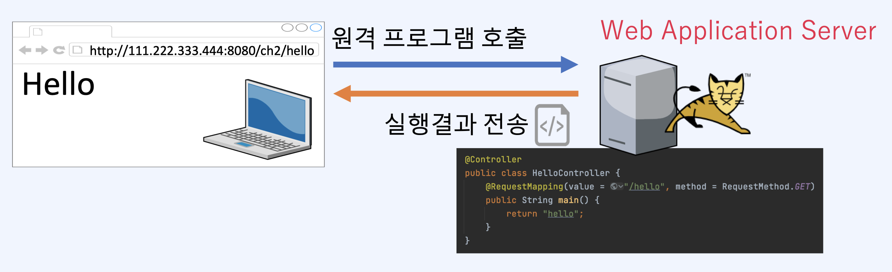

# Fastcampus NKS Spring Basic Study

### 스프링프레임워크 기초 학습

#### Repository 생성일: 2022.02.24(목)

## 개발환경

1. Language
    - OpenJDK 11.0.11
2. Build Tools
    - Apache Maven 3.6.2
3. WAS(Web Application Server)
    - Apache Tomcat 90.58
4. IDE
    - JetBrains IntelliJ IDEA Ultimate

### 원격 프로그램 실행

1. 프로그램 등록
2. URL과 프로그램을 연결

### HTTP 요청과 응답

1. 프로토콜(protocol)이란?
    - 서로 간의 통신을 위한 약속, 규칙
    - 주고 받을 데이터에 대한 형식을 정의한 것
2. HTTP(Hyper `Text` Transfer Protocol)이란?
   
    - 텍스트 기반 프로토콜
    - 단순하고 읽기 쉬움
    - 상태를 유하지 않음.
        1) 즉, 클라이언트 정보를 저장하지 않음(stateless)
    - 확장 가능
        1) 커스텀 Header 추가 가능
3. HTTP 메시지
    - 헤더(Header)와 바디(Body)로 구성
        1) HTTP 응답 메시지 예)
           
4. HTTP 메서드
    - 대표적으로 GET과 POST가 있음
      
5. 텍스트 파일과 바이너리 파일
    - 바이너리 파일: 문자와 숫자가 저장되어 있는 파일, 데이터를 있는 그대로 읽고 씀
    - 텍스트 파일: 문자만 있는 저장되어 있는 파일, 숫자를 문자로 변환 후 씀
      
6. `MIME(Multipurpose Internet Mail Extensions)`
    - 텍스트 기반 프로토콜에 바이너리 데이터를 전송하기 위해 고안
    - HTTP의 `Content-Type` 헤더에 사용
    - 데이터의 타입을 명시
      
7. Base64`
    - 바이너리 데이터를 텍스트 데이터로 변환 할 때 사용
    - 64진법은 `0 ~ 9`, `A ~ Z`, `a ~ z`, `+`, `/` 모두 64개(6 bit)의 문자로 구성되어 있음
      
    - Base64 인코딩 시 사이즈가 늘어남

#### [HttpServletRequest]

### 클라이언트와 서버

1. 클라이언트(Client): 서비스를 요청하는 애플리케이션(OR 컴퓨터)
2. 서버(Server) : 서비스를 제공하는 애플리케이션(OR 컴퓨터)

#### [서버의 종류]

1. 웹 서버(Web Server)
2. 메일 서버(Mail Server)
3. 파일 서버(File Server)

#### [포트(Port)]

1. 네트워크 서비스나 특정 프로세스를 식별하는 논리적 단위(논리적 통로)
2. 대표적으로 `80번 포트`, `443 포트`는 웹 서버 용도로 사용함
3. `0 ~ 1023 포트` 번호는 예약된 포트이며, 그 이상부터 `65,535 포트`까지 사용 가능

### 웹 애플리키에션 서버(WAS)

1. 웹 애플리케이션을 서비스 하는 서버
2. 대표적으로 `Apache Tomcat`
    - Tomcat의 설정파일
        1) 톰캣설치경로/conf/server.xml: Tomcat 서버 설정 파일
        2) 톰캣설치경로/conf/web.xml: Tomcat의 모든 web app의 공통 설정
        3) 웹앱이름/WEB-INF/web.xml: web app의 개별 설정